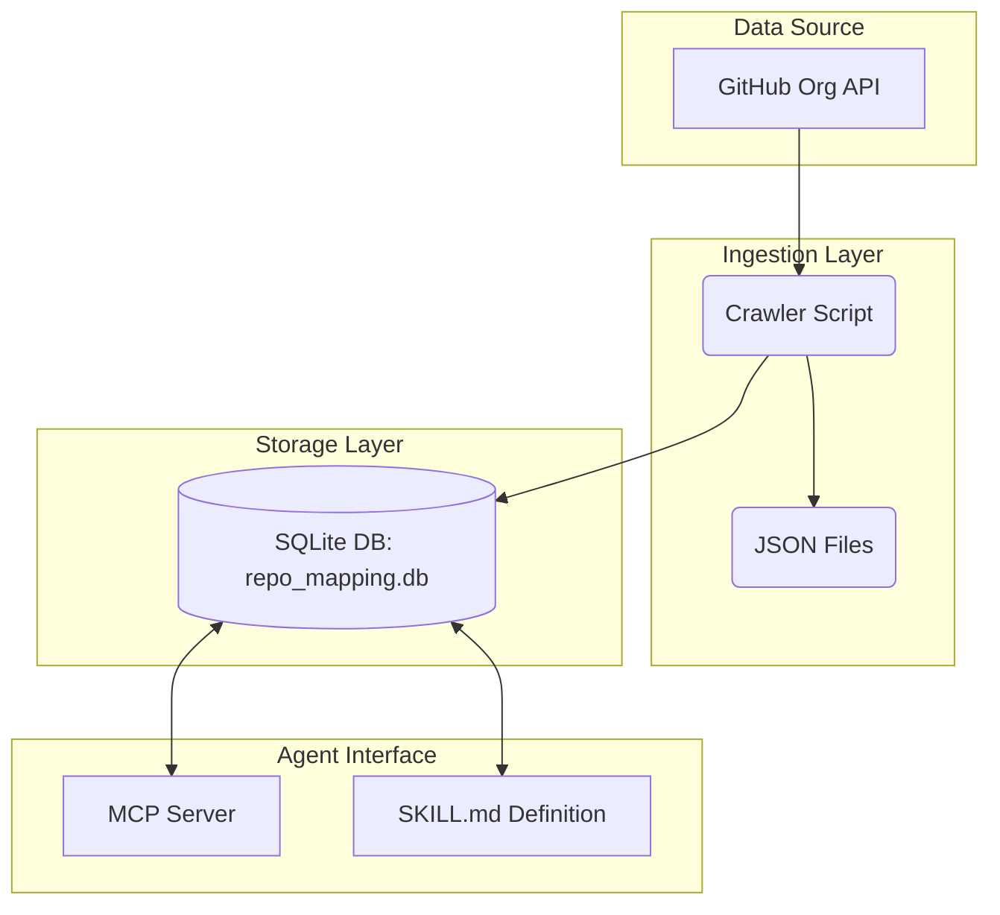

# Development Plan: Clawd Code Store & Agent Query System

## 1. Project Goal
Build a system to ingest configuration files (JSON) from GitHub repositories, map them to a local SQLite database, and provide an API/MCP interface for LLM Agents to query code metadata and content efficiently.

**Target Repository:** `clawd_code_store`  
**Objective:** Create the architectural blueprint for the "Repo <-> File Content" mapping pipeline.

---

## 2. System Architecture

The system is divided into three layers: **Ingestion**, **Storage**, and **Agent Interface**.



### Component Details
1.  **Ingestion (Crawler):** Fetches files using GitHub Tree API / Contents API. Supports glob patterns (e.g., `**/package.json`).
2.  **Storage (SQLite):** A local SQLite database serving as the knowledge base for the agents.
3.  **Interface (Agent):** Exposes data via MCP (Model Context Protocol) or standard CLI tools defined in SKILL.md.

---

## 3. Database Schema Design
**File:** `repo_mapping.db`  
**Strategy:** A flexible schema to handle one-to-many relationships between Repos and their JSON files.

### Table: `file_manifest` (Standard Approach)
Suitable for querying specific config files across all repos.

```sql
CREATE TABLE file_manifest (
    id INTEGER PRIMARY KEY AUTOINCREMENT,
    repo_name TEXT NOT NULL,           -- e.g., 'google/flutter'
    file_path TEXT NOT NULL,           -- relative path inside repo
    file_content TEXT,                 -- Raw JSON string
    parsed_summary JSON,               -- Structured summary for fast AI ingestion
    last_updated TIMESTAMP DEFAULT CURRENT_TIMESTAMP
);

CREATE INDEX idx_repo ON file_manifest(repo_name);
```

### Table: `repo_snapshot` (Alternative Approach)
Suitable if the "Repo <-> File Content" mapping implies a 1-to-1 relationship where all configs are stored in one row per repo.

```sql
CREATE TABLE repo_snapshot (
    repo_name TEXT PRIMARY KEY,        -- Primary Key is the Repo Name
    config_bundle JSON,                -- All relevant files merged into one object: { "package.json": "{...}", "deps.yml": "..." }
    metadata_json JSON,                -- Owner, Description, URL, Language
    updated_at TIMESTAMP DEFAULT CURRENT_TIMESTAMP
);
```

---

## 4. LLM Agent Query Strategy

### Method A: MCP (Model Context Protocol) - Recommended
We provide a `mcp_server.py` that exposes two tools to the agent:

1.  **`search_codebase`** (Natural Language -> Search):
    *   *Description:* "Find repositories containing specific keywords in their config files."
    *   *Params:* `query` (String), `repo_name` (Optional String)
    *   *Implementation:* Generates SQL `LIKE` queries or Vector search (if enabled).

2.  **`get_repo_context`** (Specific Lookup):
    *   *Description:* "Fetch all configuration JSONs for a specific repository."
    *   *Params:* `repo_name` (String)
    *   *Implementation:* Returns the raw JSON content mapped to that repo.

### Method B: SKILL.md Integration
For environments without full MCP support, we define tools in `.claude/skills/agent_query/SKILL.md`:

```markdown
# SKILL: Clawd Code Query

You have access to the local `clawd_code_store`. To query it:
1. Run `python3 src/agent/query_tool.py --repo "google/flutter"` via your CLI tool.
2. Or use the search command: `python3 src/agent/search_tool.py --term "eslint"`.
```

---

## 5. Implementation Roadmap

| Phase | Tasks | Outcome |
| :--- | :--- | :--- |
| **I. Design** | Finalize DB Schema, Draft MCP Tool definitions. | This document (Phase I). |
| **II. Ingestion** | Build `src/collector` to crawl GitHub Orgs. | Populate `repo_mapping.db`. |
| **III. Interface** | Create `src/mcp_server.py` and `SKILL.md`. | Ready for Agent integration. |
| **IV. Refinement** | Add semantic search (Embeddings) if simple SQL is too slow. | Advanced query capabilities. |

---

## 6. Key Technical Considerations
*   **Rate Limiting:** GitHub API has a strict rate limit (5,000 requests/hour). The crawler must implement exponential backoff and use ETags for cache validation.
*   **Token Size:** For the Agent to process "Repo <-> File Content", ensure large files are truncated or summarized in the `parsed_summary` field to fit within the LLM's context window.
*   **Concurrency:** Use `asyncio` or `concurrent.futures` in the crawler to handle multiple repos in parallel while respecting rate limits.
